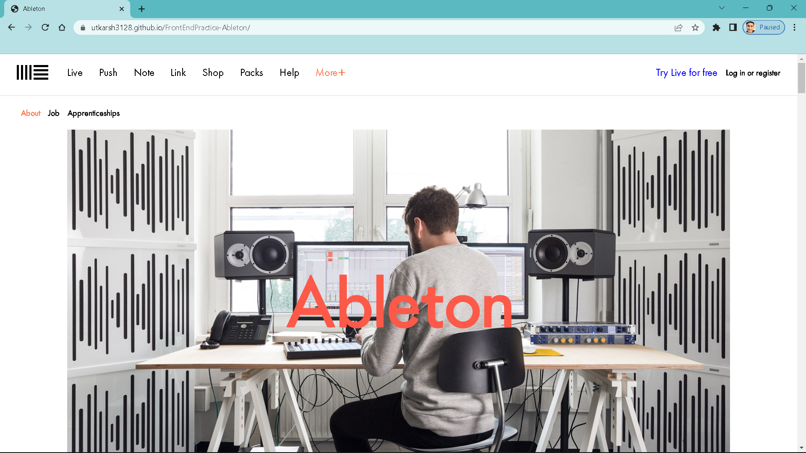

# FrontEndPractice-Ableton

Hello Everyone, This is my third practice project and all materials owned by companies and individuals whose website is featured on https://www.frontendpractice.com/ are meant for practice purposes only.

### Desktop View

### Live Site
https://www.ableton.com/en/about/

### Links:

* Template: https://www.frontendpractice.com/projects/ableton
* Code: https://github.com/Utkarsh3128/FrontendPractice-Ableton.git

### Built with
* HTML5
* Tailwind CSS

### Useful Resources

- .[Tailwind CSS](https://tailwind-css.com/): Very useful whenever got stuck while styling
- .[w3schools](https://www.w3schools.com/): Very helpful for learning Web Programming basics

### Frontend Practice - Ableton About Page
